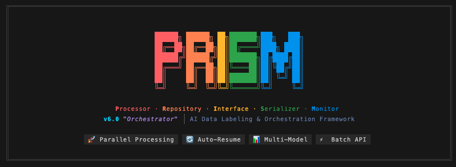
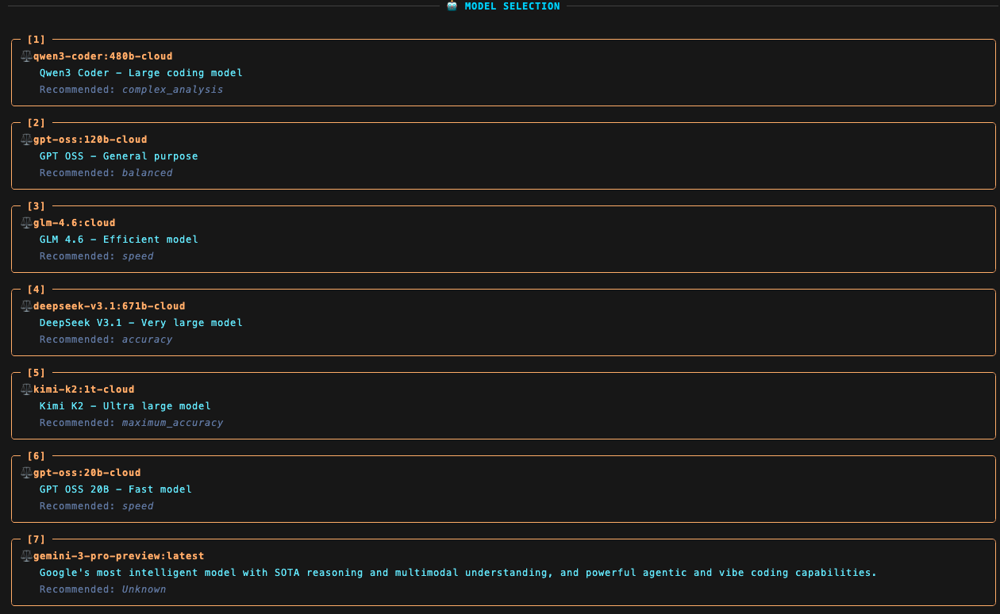
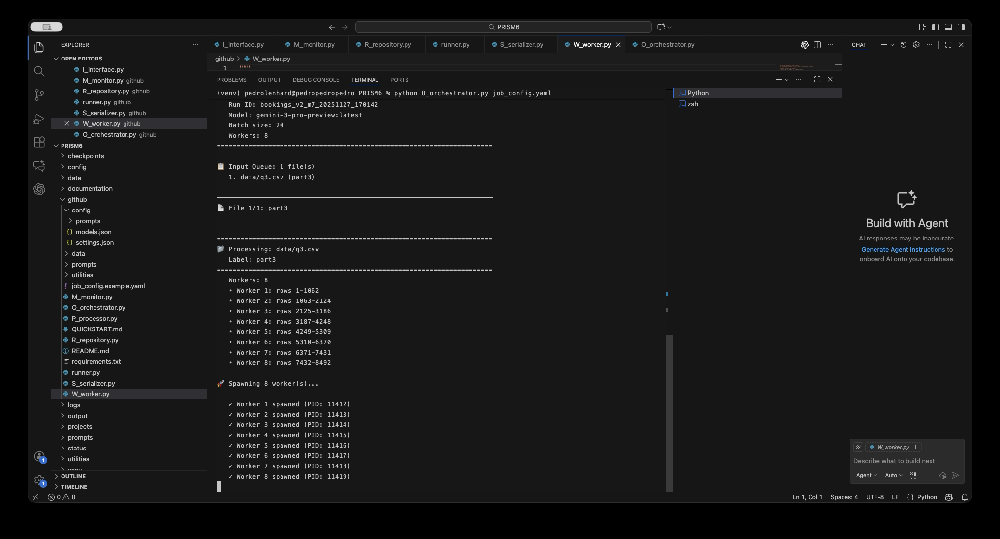
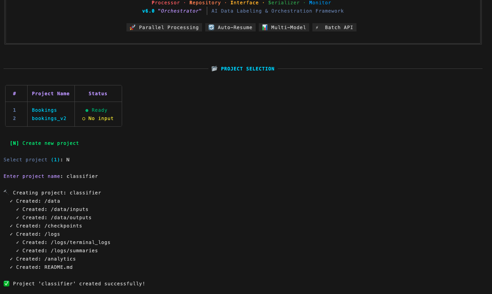
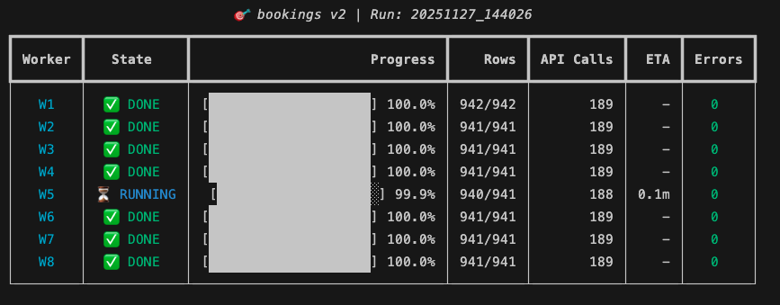

# PRISM v6

**P**rocess · **R**efine · **I**ntegrate · **S**ummarize · **M**anage

A production-ready AI processing framework for CSV-based classification using Ollama Cloud. PRISM provides two operational modes: an interactive single-file runner for exploratory work and a parallel orchestrator for large-scale batch processing.



---

## Table of Contents

- [What's New: Ollama Cloud](#whats-new-ollama-cloud)
- [Features](#features)
- [Architecture Overview](#architecture-overview)
- [Prerequisites](#prerequisites)
- [Installation](#installation)
- [Quick Start](#quick-start)
- [Configuration](#configuration)
- [Cloud Models Reference](#cloud-models-reference)
- [Usage Modes](#usage-modes)
- [Module Reference](#module-reference)
- [Prompt Engineering](#prompt-engineering)
- [Data Format](#data-format)
- [Advanced Operations](#advanced-operations)
- [Troubleshooting](#troubleshooting)

---

## What's New: Ollama Cloud

PRISM v6 now supports **Ollama Cloud** as its primary inference backend, enabling you to:

- **Run larger, more powerful models** without local GPU requirements
- **Speed up inference** using datacenter-grade hardware
- **Save battery life** by offloading compute to the cloud
- **Maintain privacy** - Ollama does not retain your data

### Cloud vs Local

| Feature | Ollama Cloud | Local Ollama |
|---------|--------------|--------------|
| GPU Required | ❌ No | ✅ Yes (for large models) |
| Model Size Limit | None (run 671B+ models) | Limited by VRAM |
| Inference Speed | Fast (datacenter GPUs) | Varies by hardware |
| Privacy | Data not retained | Fully local |
| Cost | $20/mo Pro tier | Free |
| Setup | `ollama login` | `ollama serve` |

### Supported Cloud Models

```bash
# Available cloud models (as of 2025)
deepseek-v3.1:671b-cloud    # Hybrid thinking/non-thinking, 671B MoE
gpt-oss:20b-cloud           # OpenAI open-weight, 20B, low latency
gpt-oss:120b-cloud          # OpenAI open-weight, 120B, production
kimi-k2:1t-cloud            # Moonshot AI MoE, 1T total params
kimi-k2-thinking:cloud      # Best open-source thinking model
qwen3-coder:480b-cloud      # Alibaba coding specialist, 480B
glm-4.6:cloud               # Zhipu AI, superior coding & agents
minimax-m2:cloud            # MiniMax, coding & agentic workflows
```

---

## Features

### Core Capabilities
- **Ollama Cloud Integration**: Run frontier models without local GPU
- **Dual-Mode Operation**: Interactive CLI or parallel orchestrator
- **Batch Processing**: Configurable batch sizes (1-15+ rows per API call)
- **Checkpoint System**: Automatic incremental saves with full resume capability
- **Parallel Workers**: Spawn multiple detached workers for large datasets

### Reliability & Recovery
- **Run-Scoped Identifiers**: Unique `{project}_{version}_{model}_{timestamp}` IDs
- **File-Based Status Tracking**: Workers communicate via JSON status files
- **Graceful Pause/Resume**: Lightweight flag-based pause mechanism
- **Automatic Retry**: Configurable retry logic with exponential backoff
- **Failed Range Tracking**: Persist failed row ranges for reprocessing

### Monitoring & Analytics
- **Real-Time Dashboard**: Rich terminal UI with progress bars, ETA, throughput
- **Token Statistics**: Track tokens/second, average tokens/row
- **Run Summaries**: Automatic markdown reports per run
- **Analytics Export**: CSV-based performance analytics

---

## Architecture Overview

```
┌─────────────────────────────────────────────────────────────────────────────┐
│                         PRISM v6 + Ollama Cloud                             │
├─────────────────────────────────────────────────────────────────────────────┤
│                                                                             │
│  ┌─────────────┐     ┌──────────────────────────────────────────────────┐  │
│  │  runner.py  │     │              O_orchestrator.py                   │  │
│  │ (Interactive│     │  ┌─────────┐ ┌─────────┐ ┌─────────┐            │  │
│  │    Mode)    │     │  │Worker 1 │ │Worker 2 │ │Worker N │  Parallel  │  │
│  └──────┬──────┘     │  └────┬────┘ └────┬────┘ └────┬────┘            │  │
│         │            │       └───────────┼───────────┘                  │  │
│         │            └──────────────────────────────────────────────────┘  │
│         │                                │                                  │
│         └────────────────┬───────────────┘                                  │
│                          │                                                  │
│                          ▼                                                  │
│  ┌───────────────────────────────────────────────────────────────────────┐ │
│  │  P_processor.py → Ollama Client → Cloud/Local Routing                 │ │
│  └───────────────────────────────────────────────────────────────────────┘ │
│                          │                                                  │
│            ┌─────────────┴─────────────┐                                   │
│            │                           │                                   │
│            ▼                           ▼                                   │
│  ┌─────────────────┐         ┌─────────────────┐                          │
│  │  Ollama Cloud   │         │  Local Ollama   │                          │
│  │  (datacenter)   │         │  (your GPU)     │                          │
│  │                 │         │                 │                          │
│  │ • deepseek-v3.1 │         │ • llama3.2      │                          │
│  │ • gpt-oss       │         │ • mistral       │                          │
│  │ • kimi-k2       │         │ • qwen3         │                          │
│  │ • qwen3-coder   │         │ • etc.          │                          │
│  │ • glm-4.6       │         │                 │                          │
│  │ • minimax-m2    │         │                 │                          │
│  └─────────────────┘         └─────────────────┘                          │
└─────────────────────────────────────────────────────────────────────────────┘
```

---

## Prerequisites

### For Ollama Cloud (Recommended)

1. **Ollama installed** (latest version)
2. **Ollama account** at [ollama.com](https://ollama.com)
3. **Pro subscription** ($20/mo) for extended usage

### For Local Ollama

1. **Ollama installed and running**
2. **Sufficient VRAM** for your chosen model
3. **Model downloaded**: `ollama pull <model-name>`

---

## Installation

### 1. Clone the Repository
```bash
git clone https://github.com/datainsight-agency/PRISM.git
cd prism
```

### 2. Create Virtual Environment
```bash
python3 -m venv venv
source venv/bin/activate  # Linux/macOS
# or
venv\Scripts\activate     # Windows
```

### 3. Install Dependencies
```bash
pip install -r requirements.txt
```

### 4. Configure Ollama Cloud

```bash
# Login to Ollama (opens browser for authentication)
ollama login

# Verify cloud access
ollama run gpt-oss:20b-cloud "Hello, world!"
```

### 5. (Optional) Create API Key for Direct API Access

For direct API access without the Ollama client:

1. Go to [ollama.com/settings/keys](https://ollama.com/settings/keys)
2. Create a new API key
3. Set environment variable:
```bash
export OLLAMA_API_KEY="your-api-key-here"
```

---

## Quick Start

### Using Cloud Models

**Interactive Mode:**
```bash
python3 runner.py
# Select a cloud model like "gpt-oss:20b-cloud"
```



**Automated Mode:**
```bash
# Edit job_config.yaml to use cloud model
# model:
#   name: "gpt-oss:20b-cloud"

python3 O_orchestrator.py job_config.yaml
```



---

## Configuration

### Job Configuration for Cloud Models

```yaml
# job_config.yaml - Optimized for Ollama Cloud

project:
  name: "customer_analysis"
  version: "v1"
  description: "Customer feedback classification using cloud models"

model:
  # Cloud models - no local GPU required
  name: "gpt-oss:20b-cloud"        # Fast, general purpose
  # name: "gpt-oss:120b-cloud"     # Higher accuracy
  # name: "deepseek-v3.1:671b-cloud"  # Best reasoning
  # name: "qwen3-coder:480b-cloud" # Best for code-related tasks
  # name: "glm-4.6:cloud"          # Strong agents & coding
  # name: "minimax-m2:cloud"       # Efficient agentic workflows
  # name: "kimi-k2:1t-cloud"       # 1T parameter MoE
  # name: "kimi-k2-thinking:cloud" # Best thinking model
  
  batch_size: 10                   # Rows per API call
  retries: 3                       # Retry on failure
  delay: 5                         # Seconds between retries

input_queue:
  - path: "data/feedback.csv"
    label: "feedback"

parallelization:
  enabled: true
  workers: 4                       # Cloud can handle more parallelism
  split_strategy: "auto"

output:
  directory: "output/"
  naming_pattern: "{run_id}_{label}"
  checkpoints:
    directory: "checkpoints/"
    interval: 25
    cleanup_after_merge: false

error_handling:
  strategy: "continue_and_report"
  max_worker_retries: 2
  save_failed_ranges: true
  prompt_on_failure: true

merge:
  auto_merge: true
  condition: "all_success"
  sort_by: "RowID"

prompts:
  config_file: "prompts/classification_prompt.json"

monitoring:
  status_dir: "status/"
  logs_dir: "logs/"
  dashboard_refresh: 5
```

---

## Cloud Models Reference

### Model Selection Guide

| Model | Parameters | Best For | Speed | Accuracy |
|-------|------------|----------|-------|----------|
| `gpt-oss:20b-cloud` | 20B (3.6B active) | Low latency, local use cases | ⚡⚡⚡⚡⚡ | ⭐⭐⭐ |
| `gpt-oss:120b-cloud` | 120B (5.1B active) | Production, high reasoning | ⚡⚡⚡⚡ | ⭐⭐⭐⭐ |
| `deepseek-v3.1:671b-cloud` | 671B (37B active) | Complex reasoning, tool use | ⚡⚡⚡ | ⭐⭐⭐⭐⭐ |
| `qwen3-coder:480b-cloud` | 480B | Agentic coding, 256K context | ⚡⚡⚡ | ⭐⭐⭐⭐⭐ |
| `glm-4.6:cloud` | - | Coding, agents, 198K context | ⚡⚡⚡⚡ | ⭐⭐⭐⭐ |
| `minimax-m2:cloud` | 230B (10B active) | Coding, agentic workflows | ⚡⚡⚡⚡ | ⭐⭐⭐⭐ |
| `kimi-k2:1t-cloud` | 1T (32B active) | General, 256K context | ⚡⚡⚡ | ⭐⭐⭐⭐ |
| `kimi-k2-thinking:cloud` | 1T+ | Complex reasoning, research | ⚡⚡ | ⭐⭐⭐⭐⭐ |

### Detailed Model Descriptions

#### gpt-oss (OpenAI Open Source)
```bash
ollama run gpt-oss:20b-cloud   # 20B - fast, 16GB memory
ollama run gpt-oss:120b-cloud  # 120B - production, single 80GB GPU
```
- **Architecture**: Mixture-of-Experts (MoE) with MXFP4 quantization
- **Features**: Function calling, web browsing, chain-of-thought, structured outputs
- **License**: Apache 2.0
- **Use Cases**: Reasoning, agentic tasks, general purpose

#### DeepSeek-V3.1-Terminus
```bash
ollama run deepseek-v3.1:671b-cloud
```
- **Architecture**: 671B MoE (37B active per token)
- **Features**: Hybrid thinking/non-thinking modes, superior tool calling
- **Context**: 160K tokens
- **Use Cases**: Complex reasoning, agent tasks, tool use

#### Qwen3-Coder
```bash
ollama run qwen3-coder:480b-cloud
```
- **Architecture**: 480B total, highly efficient MoE
- **Features**: Best agentic coding, multi-file editing, long context
- **Context**: 256K tokens
- **Use Cases**: Software development, code review, refactoring

#### GLM-4.6 (Zhipu AI)
```bash
ollama run glm-4.6:cloud
```
- **Features**: Superior coding, advanced reasoning, capable agents
- **Context**: 198K tokens
- **Strengths**: Function calling, frontend code generation, role-playing

#### MiniMax-M2
```bash
ollama run minimax-m2:cloud
```
- **Architecture**: 230B total (10B active) - highly efficient
- **Features**: #1 open-source on Artificial Analysis composite score
- **Context**: 200K tokens
- **Use Cases**: End-to-end coding, agentic workflows, browsing

#### Kimi K2 (Moonshot AI)
```bash
ollama run kimi-k2:1t-cloud          # Instruct version
ollama run kimi-k2-thinking:cloud    # Thinking version
```
- **Architecture**: 1T total (32B active), state-of-the-art MoE
- **Features**: 
  - **K2 Instruct**: Enhanced coding, 256K context, improved tool calling
  - **K2 Thinking**: 200-300 sequential tool calls, SOTA on HLE benchmark
- **Use Cases**: Complex multi-step reasoning, agentic search, software development

---

## Usage Modes

### Interactive Mode (`runner.py`)

```bash
python3 runner.py
```

**Workflow:**
1. Select or create a project
2. Choose a cloud model (e.g., `gpt-oss:20b-cloud`)
3. Set batch size (10 recommended for cloud)
4. Define row range
5. Confirm and start processing



### Automated Mode (`O_orchestrator.py`)

```bash
# Basic run
python3 O_orchestrator.py job_config.yaml

# Dry run (preview plan)
python3 O_orchestrator.py job_config.yaml --dry-run

# Override workers for cloud (can handle more)
python3 O_orchestrator.py job_config.yaml --workers 8

# Monitor existing run
python3 O_orchestrator.py job_config.yaml --monitor-only --run-id <run_id>

# Resume interrupted run
python3 O_orchestrator.py job_config.yaml --resume --run-id <run_id>
```


<!-- TODO: Add screenshot -->

### Pause/Resume Operations

```bash
# Pause a running job
python3 O_orchestrator.py job_config.yaml --pause-run --run-id <run_id>

# Resume paused job
python3 O_orchestrator.py job_config.yaml --resume-run --run-id <run_id>

# View run summary
python3 O_orchestrator.py job_config.yaml --summary --run-id <run_id>
```

---

## Module Reference

### P_processor.py - Processing Engine

Handles all Ollama API communication, supporting both cloud and local models transparently.

```python
processor = Processor(
    model_name="gpt-oss:20b-cloud",  # Cloud model
    prompts_config=prompts_config,
    retries=3,
    delay=5
)

# The processor automatically routes to cloud or local
results, api_calls = processor.process_dataframe(
    df=df,
    batch_size=10,
    monitor=monitor,
    serializer=serializer,
    job_id="job_123",
    metadata={"Model_Name": "gpt-oss:20b-cloud"}
)
```

### Key Processing Features

- **Automatic Cloud Routing**: Models ending in `-cloud` are processed via Ollama Cloud
- **Token Tracking**: Monitors prompt/completion tokens for analytics
- **Batch Processing**: Groups rows for efficient API usage
- **Fallback Logic**: On batch failure, falls back to single-row processing
- **Pause Hook**: Supports cooperative pause via `pause_event` parameter

---

## Prompt Engineering

### Prompt Schema for Cloud Models

Cloud models excel with clear, structured prompts:

```json
{
  "system_prompt": "You are a customer feedback analyst. For each message, classify into structured categories. Return ONLY valid JSON.\n\nCategories:\n- Topic: Product, Support, Billing, Shipping, Account, Other\n- Sentiment: Positive, Negative, Neutral, Mixed\n- Urgency: High, Medium, Low\n- Key_Point: One-sentence summary\n\nIf not relevant feedback, set Topic to 'NOT_APPLICABLE'.",
  
  "columns_to_code": [
    "Topic",
    "Sentiment",
    "Urgency",
    "Key_Point"
  ],
  
  "validation_rules": {
    "valid_topic": ["Product", "Support", "Billing", "Shipping", "Account", "Other", "NOT_APPLICABLE"],
    "valid_sentiment": ["Positive", "Negative", "Neutral", "Mixed"],
    "valid_urgency": ["High", "Medium", "Low"]
  },
  
  "not_applicable_defaults": {
    "Topic": "Other",
    "Sentiment": "Neutral",
    "Urgency": "Low",
    "Key_Point": "-"
  }
}
```

### Best Practices for Cloud Models

1. **Leverage Reasoning**: Cloud models like `deepseek-v3.1` and `kimi-k2-thinking` excel at multi-step reasoning
2. **Use Larger Batches**: Cloud can handle `batch_size: 15` efficiently
3. **Explicit JSON Format**: Always specify "Return ONLY valid JSON"
4. **Chain-of-Thought**: For complex tasks, enable thinking mode prompts

---

## Data Format

### Input Requirements

| Column | Required | Description |
|--------|----------|-------------|
| `RowID` | **Yes** | Unique integer identifier |
| `Message` | **Yes** | Text content to classify |
| `Title` | No | Optional title/subject |
| `Sentiment` | No | Pre-existing sentiment for validation |

### Example Input
```csv
RowID,Title,Message,Sentiment
1,Great product!,I love this product. Works perfectly.,Positive
2,Shipping delay,My order arrived 2 weeks late.,Negative
3,,The app crashes on login,Negative
4,Question,How do I reset my password?,Neutral
```

### Output Format
```csv
RowID,Sentiment,Topic,Validated_Sentiment,Urgency,Key_Point,Model_Name,Batch_Size,Run_ID
1,Positive,Product,Positive,Low,Customer satisfied with quality,gpt-oss:20b-cloud,10,analysis_v1_m1_20250127
```

---

## Advanced Operations

### Cloud-Specific Optimizations

**Higher Parallelism:**
```yaml
parallelization:
  enabled: true
  workers: 8  # Cloud can handle more workers
```

**Larger Batches:**
```yaml
model:
  name: "gpt-oss:120b-cloud"
  batch_size: 15  # Cloud models handle larger batches well
```

**Thinking Models for Complex Tasks:**
```yaml
model:
  name: "kimi-k2-thinking:cloud"  # For research-grade analysis
  batch_size: 5  # Smaller batches for thinking models
```

### Direct API Access

For advanced integrations, use the Ollama Cloud API directly:

```bash
# Set API key
export OLLAMA_API_KEY="your-key"

# List available models
curl -H "Authorization: Bearer $OLLAMA_API_KEY" \
  https://api.ollama.com/v1/models

# Generate response
curl -X POST https://api.ollama.com/v1/chat/completions \
  -H "Authorization: Bearer $OLLAMA_API_KEY" \
  -H "Content-Type: application/json" \
  -d '{
    "model": "gpt-oss:20b-cloud",
    "messages": [{"role": "user", "content": "Hello"}]
  }'
```

---

## Troubleshooting

### Cloud-Specific Issues

#### "Model not found" for cloud models
```bash
# Ensure you're logged in
ollama login

# Verify Pro subscription at ollama.com
```

#### Rate limiting
```
⚠️ Rate limit exceeded
```
**Solution**: Reduce `workers` count or batch size. Usage-based pricing coming soon.

#### Slow responses
**Solution**: Try a smaller model (`gpt-oss:20b-cloud`) or reduce batch size.

### General Issues

#### Connection errors
```bash
# Check Ollama is running
ollama list

# For cloud, verify login
ollama login
```

#### JSON parse errors
```
⚠️ Row 123: JSON parse error
```
**Solution**: Reduce batch size to 1, simplify prompt, or try different model.

---

## CLI Reference

### runner.py
```bash
python3 runner.py
# Interactive mode - no arguments
```

### O_orchestrator.py
```
python3 O_orchestrator.py <config> [options]

Arguments:
  config                    Path to job_config.yaml

Options:
  --dry-run                 Show execution plan
  --workers N               Override worker count
  --version TAG             Override version tag
  --monitor-only            Monitor existing workers
  --run-id ID               Use explicit run ID
  --resume                  Resume previous run
  --summary                 Print run summary
  --pause-run               Create pause flag
  --resume-run              Remove pause flag
```

---

## Performance Benchmarks

### Cloud Model Throughput (Approximate)

| Model | Batch Size | Rows/min | Tokens/sec |
|-------|------------|----------|------------|
| gpt-oss:20b-cloud | 10 | 30-50 | 200-400 |
| gpt-oss:120b-cloud | 10 | 20-35 | 150-300 |
| deepseek-v3.1:671b-cloud | 10 | 15-25 | 100-200 |
| qwen3-coder:480b-cloud | 10 | 15-25 | 100-200 |

*Actual performance depends on prompt complexity, response length, and current load.*


---

## Acknowledgments

- [Ollama](https://ollama.com/) for cloud and local LLM infrastructure
- [OpenAI](https://openai.com/) for gpt-oss models
- [DeepSeek](https://deepseek.com/) for DeepSeek-V3.1
- [Alibaba](https://www.alibabacloud.com/) for Qwen3-Coder
- [Zhipu AI](https://www.zhipuai.cn/) for GLM-4.6
- [MiniMax](https://www.minimaxi.com/) for MiniMax-M2
- [Moonshot AI](https://www.moonshot.cn/) for Kimi K2

---

**Built with ❤️ for scalable AI processing**
